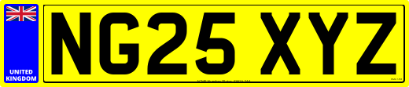
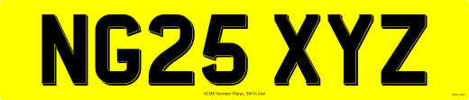

# Example Oblong Plates

A collection of oblong plates created with the Plateit number plate generator and the code used to create them.

## Standard Oblong


```javascript
// Document
plate.document.setWidth(520)
plate.document.setHeight(111)
plate.document.setBackgroundColour('yellow')

// Reg
plate.reg.setText('NG25 XYZ')
plate.reg.setTextColour('black')
plate.reg.setTextHeight(79)
plate.reg.setTextFont('../assets/fonts/CharlesWright-Car.ttf')
plate.reg.utilise(true)

// Bottom Line
plate.bottomLine.setText('ACME Number Plates, SW1A 2AA')
plate.bottomLine.setTextHeight(4)
plate.bottomLine.setTextFont('../assets/fonts/OpenSans-Regular.ttf')
plate.bottomLine.utilise(true)

// Bsau
plate.bsau.setTextFont('../assets/fonts/OpenSans-Regular.ttf')
plate.bsau.setTextHeight(2)
plate.bsau.utilise(true)

// Render
plate.render()
```
## Standard Oblong With Border and Side Badge



```javascript
// Document
plate.document.setWidth(520)
plate.document.setHeight(111)
plate.document.setBackgroundColour('yellow')

// Reg
plate.reg.setText('NG25 XYZ')
plate.reg.setTextHeight(79)
plate.reg.setTextFont('../assets/fonts/CharlesWright-Car.ttf')
plate.reg.utilise(true)

// Bottom Line
plate.bottomLine.setText('ACME Number Plates, SW1A 2AA')
plate.bottomLine.setTextHeight(4)
plate.bottomLine.setTextFont('../assets/fonts/OpenSans-Regular.ttf')
plate.bottomLine.utilise(true)

// Bsau
plate.bsau.setTextFont('../assets/fonts/OpenSans-Regular.ttf')
plate.bsau.setTextHeight(2)
plate.bsau.utilise(true)

// Border
plate.border.setThickness(2)
plate.border.setColour('black')
plate.border.utilise(true)

// Left Side Badge
plate.sideBadgeLeft.setWidth(44)
plate.sideBadgeLeft.setBackgroundColour('blue')
plate.sideBadgeLeft.setImage('../assets/badges/FlagUnionJack.svg')
plate.sideBadgeLeft.setText(['UNITED', 'KINGDOM'])
plate.sideBadgeLeft.setTextFont('../assets/fonts/OpenSans-ExtraBold.ttf')
plate.sideBadgeLeft.utilise(true)

// Render
plate.render()
```

## Standard Oblong "4D"



> The "4D" font file is being used to create the raised effect. **This should be used for customer previews only**. It will be printed like this if it is not removed!

```javascript
// Document
plate.document.setWidth(520)
plate.document.setHeight(111)
plate.document.setBackgroundColour('yellow')

// Reg
plate.reg.setText('NG25 XYZ')
plate.reg.setTextHeight(79)
plate.reg.setTextFont('../assets/fonts/CharlesWright-Car-4D.ttf')
plate.reg.utilise(true)

// Bottom Line
plate.bottomLine.setText('ACME Number Plates, SW1A 2AA')
plate.bottomLine.setTextHeight(4)
plate.bottomLine.setTextFont('../assets/fonts/OpenSans-Regular.ttf')
plate.bottomLine.utilise(true)

// Bsau
plate.bsau.setTextFont('../assets/fonts/OpenSans-Regular.ttf')
plate.bsau.setTextHeight(2)
plate.bsau.utilise(true)

// Render
plate.render().then(() => {

    // 3D/4D Letters are pre-cut to a specific size and stuck on.
    // If the reg has been shrunk to fit, it won't work.

    if(plate.reg.hasResized()) {
        alert('The reg is too long to accomodate 3D/4D letters')
    }

})
```

## Standard Oblong 3D Effect


> The (printed) 3D effect consists of two fonts stacked on top of each other. It's no longer considered legal for road use.

```javascript
// Document
plate.document.setWidth(520)
plate.document.setHeight(111)
plate.document.setBackgroundColour('yellow')

// Reg
plate.reg.setText('NG25 XYZ')
plate.reg.setTextColour('black@0.7')
plate.reg.setTextHeight(79)
plate.reg.setTextFont('../assets/fonts/CharlesWright-Car.ttf')
plate.reg.utilise(true)

// Reg Overlay
plate.regOverlay.setText('NG25 XYZ')
plate.regOverlay.setTextColour('black')
plate.regOverlay.setTextHeight(79)
plate.regOverlay.setTextFont('../assets/fonts/CharlesWright-Car-Overlay-3D.ttf')
plate.regOverlay.utilise(true)

// Bottom Line
plate.bottomLine.setText('ACME Number Plates, SW1A 2AA')
plate.bottomLine.setTextHeight(4)
plate.bottomLine.setTextFont('../assets/fonts/OpenSans-Regular.ttf')
plate.bottomLine.utilise(true)

// Bsau
plate.bsau.setTextFont('../assets/fonts/OpenSans-Regular.ttf')
plate.bsau.setTextHeight(2)
plate.bsau.utilise(true)

// Render
plate.render()
```
## Metal Oblong


```javascript
// Document
plate.document.setWidth(520)
plate.document.setHeight(111)
plate.document.setBackgroundColour(['lightgray', 'gray', 'y'])

// Reg
plate.reg.setText('NG25 XYZ')
plate.reg.setTextColour('black')
plate.reg.setTextHeight(79)
plate.reg.setTextFont('../assets/fonts/CharlesWright-Car.ttf')
plate.reg.setTextCutOut(true)
plate.reg.utilise(true)

// Border
plate.border.setThickness(0)
plate.border.setInnerColour('black')
plate.border.setInnerMargin(5)
plate.border.utilise(true)

// Render
plate.render()
```
[Example Square Plates](examples/squares.md)