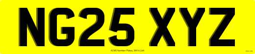

# Example Oblong Plates

A collection of oblong plates created with the Plateit number plate generator and the code used to create them.

## Standard Oblong


```javascript
// Document.
plate.document
  .setWidth(520)
  .setHeight(111)

// Background.
plate.background
  .setBackgroundColour('yellow')
  .utilise(true)

// Reg.
plate.reg
  .setText('NG25 XYZ')
  .setTextColour('black')
  .setTextHeight(79)
  .setTextFont('../assets/fonts/CharlesWright-Car.ttf')
  .utilise(true)

// Bottom Line.
plate.bottomLine
  .setText('Acme Number Plates SW1A 2AA')
  .setTextHeight(4)
  .setTextFont('../assets/fonts/OpenSans-Regular.ttf')
  .utilise(true)

// Bsau.
plate.bsau
  .setText('Acme BSAU 145e')
  .setTextFont('../assets/fonts/OpenSans-Regular.ttf')
  .utilise(true)

// Render.
plate.render()
```
## Standard Oblong With Side Badge


```javascript
// Document.
plate.document
  .setWidth(520)
  .setHeight(111)

// Background.
plate.background
  .setBackgroundColour('yellow')
  .utilise(true)

// Reg.
plate.reg
  .setText('NG25 XYZ')
  .setTextHeight(79)
  .setTextFont('../assets/fonts/CharlesWright-Car.ttf')
  .utilise(true)

// Bottom Line.
plate.bottomLine
  .setText('Acme Number Plates SW1A 2AA')
  .setTextHeight(4)
  .setTextFont('../assets/fonts/OpenSans-Regular.ttf')
  .utilise(true)

// Bsau.
plate.bsau
  .setText('Acme BSAU 145e')
  .setTextFont('../assets/fonts/OpenSans-Regular.ttf')
  .utilise(true)

// Left Side Badge.
plate.sideBadgeLeft
  .setWidth(44)
  .setBackgroundColour('blue')
  .setImage('../assets/badges/FlagUnionJack.svg')
  .setText(['UNITED', 'KINGDOM'])
  .setTextFont('../assets/fonts/OpenSans-ExtraBold.ttf')
  .utilise(true)

// Render.
plate.render()
```

## Standard Oblong With BSAU Not in Border


> By default, if a border is present, the bsau will be embedded within the bottom-left corner of the border. It can optionally sit above the border instead.

```javascript
// Document.
plate.document
  .setWidth(520)
  .setHeight(111)

// Background.
plate.background
  .setBackgroundColour('yellow')
  .utilise(true)

// Reg.
plate.reg
  .setText('NG25 XYZ')
  .setTextHeight(79)
  .setTextFont('../assets/fonts/CharlesWright-Car.ttf')
  .utilise(true)

// Bottom Line.
plate.bottomLine
  .setText('Acme Number Plates SW1A 2AA')
  .setTextHeight(4)
  .setTextFont('../assets/fonts/OpenSans-Regular.ttf')
  .utilise(true)

// Bsau.
plate.bsau
  .setText('Acme BSAU 145e')
  .setTextFont('../assets/fonts/OpenSans-Regular.ttf')
  .setInBorder(false)
  .utilise(true)

// Border.
plate.border
  .setThickness(2)
  .setColour('black')
  .utilise(true)

// Render.
plate.render()
```

## Standard Oblong With Reg Force Centred


> You can force-centre a registration to prevent it being placed off-centre to account for the presence of a side badge. This may be desirable for plates with short registrations because they can appear misaligned with the document-centred bottom line.

```javascript
// Document.
plate.document
  .setWidth(520)
  .setHeight(111)

// Background.
plate.background
  .setBackgroundColour('yellow')
  .utilise(true)

// Reg.
plate.reg
  .setText('A1')
  .setTextHeight(79)
  .setTextFont('../assets/fonts/CharlesWright-Car.ttf')
  .setAlignToCentreDoc(true) //<-- this
  .utilise(true)

// Bottom Line.
plate.bottomLine
  .setText('Acme Number Plates SW1A 2AA')
  .setTextHeight(4)
  .setTextFont('../assets/fonts/OpenSans-Regular.ttf')
  .utilise(true)

// Bsau.
plate.bsau
  .setText('Acme BSAU 145e')
  .setTextFont('../assets/fonts/OpenSans-Regular.ttf')
  .utilise(true)

// Left Side Badge.
plate.sideBadgeLeft
  .setWidth(44)
  .setBackgroundColour('blue')
  .setImage('../assets/badges/FlagUnionJack.svg')
  .setText(['UNITED', 'KINGDOM'])
  .setTextFont('../assets/fonts/OpenSans-ExtraBold.ttf')
  .utilise(true)

// Render.
plate.render()
```

## Standard Oblong 4D


> The "4D" font file is being used to create the raised effect. **This should be used for customer previews only**. It will be printed like this if it is not removed!

```javascript
// Document.
plate.document
  .setWidth(520)
  .setHeight(111)

// Background.
plate.background
  .setBackgroundColour('yellow')
  .utilise(true)

// Reg.
plate.reg
  .setText('NG25 XYZ')
  .setTextHeight(79)
  .setTextFont('../assets/fonts/CharlesWright-Car-4D.ttf')
  .utilise(true)

// Bottom Line.
plate.bottomLine
  .setText('Acme Number Plates SW1A 2AA')
  .setTextHeight(4)
  .setTextFont('../assets/fonts/OpenSans-Regular.ttf')
  .utilise(true)

// Bsau.
plate.bsau
  .setText('Acme BSAU 145e')
  .setTextFont('../assets/fonts/OpenSans-Regular.ttf')
  .utilise(true)

// Render.
plate.render().then(() => {

  // 3D/4D Letters are pre-cut to a specific size and stuck on.
  // If the reg has been shrunk to fit, it won't work.

  if (plate.renderers.reg.hasRegResized()) {
    alert('The reg is too long to accommodate 3D/4D letters')
  }

})
```

## Standard Oblong 4D Stacked



> The raised effect is being created by stacking multiple [registration layers](/additional/registration-overlay-store.md). Unlike the previous "4D" font example, this version doesn't require a separate preview file because the lighter-opacity reg has been set to `doNotPrint`.

```javascript
// Document.
plate.document
  .setWidth(520)
  .setHeight(111)

// Background.
plate.background
  .setBackgroundColour('yellow')
  .utilise(true)

// Reg (this layer will be printed).
plate.reg
  .setText('NG25 XYZ')
  .setTextHeight(79)
  .setTextFont('../assets/fonts/CharlesWright-Car.ttf')
  .setTextColour('black')
  .utilise(true)

// Reg Overlay (this layer will *not* be printed).
plate.regOverlays
  .createLayer()
  .setText('NG25 XYZ')
  .setTextHeight(79)
  .setTextFont('../assets/fonts/CharlesWright-Car.ttf')
  .setTextColour('gray')
  .setTextOffset(1, 0)
  .setDoNotPrint(true)
  .utilise(true)

// Reg Overlay (this layer will *not* be printed).
plate.regOverlays
  .createLayer()
  .setText('NG25 XYZ')
  .setTextHeight(79)
  .setTextFont('../assets/fonts/CharlesWright-Car.ttf')
  .setTextColour('black')
  .setTextOffset(2, 0)
  .setDoNotPrint(true)
  .utilise(true)

// Bottom Line.
plate.bottomLine
  .setText('Acme Number Plates SW1A 2AA')
  .setTextHeight(4)
  .setTextFont('../assets/fonts/OpenSans-Regular.ttf')
  .utilise(true)

// Bsau.
plate.bsau
  .setText('Acme BSAU 145e')
  .setTextFont('../assets/fonts/OpenSans-Regular.ttf')
  .utilise(true)

// Render.
plate.render().then(() => {

  // 3D/4D Letters are pre-cut to a specific size and stuck on.
  // If the reg has been shrunk to fit, it won't work.

  if (plate.renderers.reg.hasRegResized()) {
    alert('The reg is too long to accommodate 3D/4D letters')
  }

})
```

## Standard Oblong 3D Effect


> The (printed) 3D effect consists of two fonts stacked on top of each other. It's no longer considered legal for road use.

```javascript
// Document.
plate.document
  .setWidth(520)
  .setHeight(111)

// Background.
plate.background
  .setBackgroundColour('yellow')
  .utilise(true)

// Reg.
plate.reg
  .setText('NG25 XYZ')
  .setTextColour('black@0.7')
  .setTextHeight(79)
  .setTextFont('../assets/fonts/CharlesWright-Car.ttf')
  .utilise(true)

// Reg Overlay.
plate.regOverlays
  .createLayer()
  .setText('NG25 XYZ')
  .setTextColour('black')
  .setTextHeight(79)
  .setTextFont('../assets/fonts/CharlesWright-Car-Overlay-3D.ttf')
  .utilise(true)

// Bottom Line.
plate.bottomLine
  .setText('Acme Number Plates SW1A 2AA')
  .setTextHeight(4)
  .setTextFont('../assets/fonts/OpenSans-Regular.ttf')
  .utilise(true)

// Bsau.
plate.bsau
  .setText('Acme BSAU 145e')
  .setTextFont('../assets/fonts/OpenSans-Regular.ttf')
  .utilise(true)

// Render.
plate.render()
```

## Standard Oblong With Rasterised Side Badge


> Using a rasterised side badge cover image can be legal, but the example here is not. It is for illustrative purposes only.

```javascript
// Document.
plate.document
  .setWidth(520)
  .setHeight(111)

// Background.
plate.background
  .setBackgroundColour('yellow')
  .utilise(true)

// Reg.
plate.reg
  .setText('NG25 XYZ')
  .setTextColour('black')
  .setTextHeight(79)
  .setTextFont('../assets/fonts/CharlesWright-Car.ttf')
  .utilise(true)

// Bottom Line.
plate.bottomLine
  .setText('Acme Number Plates SW1A 2AA')
  .setTextHeight(4)
  .setTextFont('../assets/fonts/OpenSans-Regular.ttf')
  .utilise(true)

// Bsau.
plate.bsau
  .setText('Acme BSAU 145e')
  .setTextFont('../assets/fonts/OpenSans-Regular.ttf')
  .utilise(true)

// Left Side Badge.
plate.sideBadgeLeft
  .setWidth(44)
  .setCover('../assets/other/dog.jpg')
  .utilise(true)

// Render.
plate.render()
```

## Metal Oblong


```javascript
// Document.
plate.document
  .setWidth(520)
  .setHeight(111)

// Background.
plate.background
  .setBackgroundColour(['lightgray', 'gray', 'y'])
  .utilise(true)

// Reg.
plate.reg
  .setText('NG25 XYZ')
  .setTextColour('black')
  .setTextHeight(79)
  .setTextFont('../assets/fonts/CharlesWright-Car.ttf')
  .setTextCutOut(true)
  .utilise(true)

// Border.
plate.border
  .setThickness(0)
  .setInnerColour('black')
  .setInnerMargin(5)
  .utilise(true)

// Render.
plate.render()
```