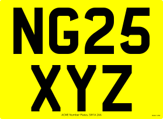
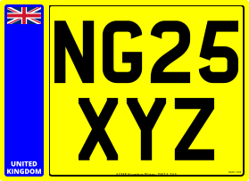
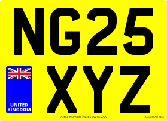
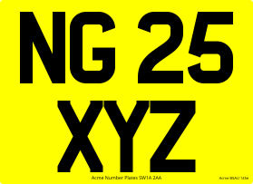
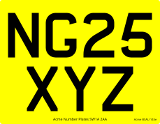
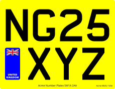

# Example Square Plates

A collection of square plates created with the Plateit number plate generator and the code used to create them.

## Standard Car Square



```javascript
// Document.
plate.document
  .setWidth(279)
  .setHeight(203)

// Background.
plate.background
  .setBackgroundColour('yellow')
  .utilise(true)

// Reg.
plate.reg
  .setText(['NG25', 'XYZ'])
  .setTextColour('black')
  .setTextHeight(79)
  .setTextLineGap(19)
  .setTextFont('../assets/fonts/CharlesWright-Car.ttf')
  .utilise(true)

// Bottom Line.
plate.bottomLine
  .setText('Acme Number Plates SW1A 2AA')
  .setTextHeight(4)
  .setTextFont('../assets/fonts/OpenSans-Regular.ttf')
  .utilise(true)

// Bsau.
plate.bsau
  .setText('Acme BSAU 145e')
  .setTextFont('../assets/fonts/OpenSans-Regular.ttf')
  .utilise(true)

// Render.
plate.render()
```

## Standard Car Square with Border and Side Badge



> **This will almost always be illegal for road use!** This is because the reg needs to be shrunk to fit a full-height side badge. To adhere to legal specifications on multi-line plates, opt for a [floating side badge](#standard-car-square-with-floating-side-badge) instead.

```javascript
// Document.
plate.document
  .setWidth(279)
  .setHeight(203)

// Background.
plate.background
  .setBackgroundColour('yellow')
  .utilise(true)

// Reg.
plate.reg
  .setText(['NG25', 'XYZ'])
  .setTextColour('black')
  .setTextHeight(79)
  .setTextLineGap(19)
  .setTextFont('../assets/fonts/CharlesWright-Car.ttf')
  .utilise(true)

// Bottom Line.
plate.bottomLine
  .setText('Acme Number Plates SW1A 2AA')
  .setTextHeight(4)
  .setTextFont('../assets/fonts/OpenSans-Regular.ttf')
  .utilise(true)

// Bsau.
plate.bsau
  .setText('Acme BSAU 145e')
  .setTextFont('../assets/fonts/OpenSans-Regular.ttf')
  .utilise(true)

// Border.
plate.border
  .setThickness(2)
  .setColour('black')
  .utilise(true)

// Left Side Badge.
plate.sideBadgeLeft
  .setWidth(44)
  .setBackgroundColour('blue')
  .setImage('../assets/badges/FlagUnionJack.svg')
  .setText(['UNITED', 'KINGDOM'])
  .setTextFont('../assets/fonts/OpenSans-ExtraBold.ttf')
  .utilise(true)

// Render.
plate.render()
```
## Standard Car Square with Floating Side Badge



> Designed for multi-line plates, a "floating" side badge will always position itself on the shortest line and will be the same height as the registration text.

```javascript
// Document.
plate.document
  .setWidth(279)
  .setHeight(203)

// Background.
plate.background
  .setBackgroundColour('yellow')
  .utilise(true)

// Reg.
plate.reg
  .setText(['NG25', 'XYZ'])
  .setTextColour('black')
  .setTextHeight(79)
  .setTextLineGap(19)
  .setTextFont('../assets/fonts/CharlesWright-Car.ttf')
  .utilise(true)

// Bottom Line.
plate.bottomLine
  .setText('Acme Number Plates SW1A 2AA')
  .setTextHeight(4)
  .setTextFont('../assets/fonts/OpenSans-Regular.ttf')
  .utilise(true)

// Bsau.
plate.bsau
  .setText('Acme BSAU 145e')
  .setTextFont('../assets/fonts/OpenSans-Regular.ttf')
  .utilise(true)

// Left Side Badge.
plate.sideBadgeLeft
  .setWidth(44)
  .setBackgroundColour('blue')
  .setImage('../assets/badges/FlagUnionJack.svg')
  .setText(['UNITED', 'KINGDOM'])
  .setTextFont('../assets/fonts/OpenSans-ExtraBold.ttf')
  .setInsideBorder(true)
  .setFloating(true)
  .utilise(true)

// Render.
plate.render()
```

## Standard Car Square with Custom Character Spacing



> The space between the characters is usually determined by the font's in-built kerning rules. However, this can manually be overridden. [See here for more details](/components/registration.md#settextchargap).

```javascript
// Document.
plate.document
  .setWidth(279)
  .setHeight(203)

// Background.
plate.background
  .setBackgroundColour('yellow')
  .utilise(true)

// Reg.
plate.reg
  .setText(['NG25', 'XYZ'])
  .setTextColour('black')
  .setTextHeight(79)
  .setTextLineGap(19)
  .setTextFont('../assets/fonts/CharlesWright-Car.ttf')
  .setTextCharGap([
    // Line one (null uses the font's default kerning).
    [5, 25, 5, null],
    // Line two (omissions also use the font's default kerning).
    [1, 1]
  ])
  .utilise(true)

// Bottom Line.
plate.bottomLine
  .setText('Acme Number Plates SW1A 2AA')
  .setTextHeight(4)
  .setTextFont('../assets/fonts/OpenSans-Regular.ttf')
  .utilise(true)

// Bsau.
plate.bsau
  .setText('Acme BSAU 145e')
  .setTextFont('../assets/fonts/OpenSans-Regular.ttf')
  .utilise(true)

// Render.
plate.render()
```

## Standard Motorcycle Square



> Note the different font file and dimensions.

```javascript
// Document.
plate.document
  .setWidth(229)
  .setHeight(178)

// Background.
plate.background
  .setBackgroundColour('yellow')
  .utilise(true)

// Reg.
plate.reg
  .setText(['NG25', 'XYZ'])
  .setTextColour('black')
  .setTextHeight(64)
  .setTextLineGap(13)
  .setTextFont('../assets/fonts/CharlesWright-Motorcycle.ttf')
  .utilise(true)

// Bottom Line.
plate.bottomLine
  .setText('Acme Number Plates SW1A 2AA')
  .setTextHeight(4)
  .setTextFont('../assets/fonts/OpenSans-Regular.ttf')
  .utilise(true)

// Bsau.
plate.bsau
  .setText('Acme BSAU 145e')
  .setTextFont('../assets/fonts/OpenSans-Regular.ttf')
  .utilise(true)

// Render.
plate.render()
```

## Standard Motorcycle Square With Floating Side Badge



```javascript
// Document.
plate.document
  .setWidth(229)
  .setHeight(178)

// Background.
plate.background
  .setBackgroundColour('yellow')
  .utilise(true)

// Reg.
plate.reg
  .setText(['NG25', 'XYZ'])
  .setTextColour('black')
  .setTextHeight(64)
  .setTextLineGap(13)
  .setTextFont('../assets/fonts/CharlesWright-Motorcycle.ttf')
  .utilise(true)

// Bottom Line.
plate.bottomLine
  .setText('Acme Number Plates SW1A 2AA')
  .setTextHeight(4)
  .setTextFont('../assets/fonts/OpenSans-Regular.ttf')
  .utilise(true)

// Bsau.
plate.bsau
  .setText('Acme BSAU 145e')
  .setTextFont('../assets/fonts/OpenSans-Regular.ttf')
  .utilise(true)

// Left Side Badge.
plate.sideBadgeLeft
  .setWidth(30)
  .setBackgroundColour('blue')
  .setImage('../assets/badges/FlagUnionJack.svg')
  .setText(['UNITED', 'KINGDOM'])
  .setTextFont('../assets/fonts/OpenSans-ExtraBold.ttf')
  .setInsideBorder(true)
  .setFloating(true)
  .utilise(true)

// Render.
plate.render()
```

## Wacky


> A completely illegal, wacky (and tacky) number plate to demonstrate its capabilities.

```javascript
// Document.
plate.document
  .setWidth(279)
  .setHeight(203)

// Background.
plate.background
  .setBackgroundColour('yellow')
  .utilise(true)

// Reg.
plate.reg
  .setText(['NG25', 'XYZ'])
  .setTextColour(['red', 'black', 'r'])
  .setTextHeight(79)
  .setTextLineGap(19)
  .setTextFont('../assets/fonts/Bangers-Regular.ttf')
  .utilise(true)

// Bottom Line.
plate.bottomLine
  .setText('Acme Number Plates SW1A 2AA')
  .setTextHeight(4)
  .setTextFont('../assets/fonts/OpenSans-Regular.ttf')
  .utilise(true)

// Bsau.
plate.bsau
  .setText('Acme BSAU 145e')
  .setTextFont('../assets/fonts/OpenSans-Regular.ttf')
  .utilise(true)

// Border.
plate.border
  .setThickness(2)
  .setColour(['black', 'red', 'blue'])
  .utilise(true)

// Left Side Badge.
plate.sideBadgeLeft
  .setWidth(44)
  .setBackgroundColour(['blue', 'green', 'y'])
  .setImage('../assets/badges/FlagUnionJackPortrait.svg')
  .setText(['UNITED', 'KINGDOM'])
  .setTextColour('black')
  .setTextCutOut(true)
  .setTextFont('../assets/fonts/OpenSans-ExtraBold.ttf')
  .utilise(true)

// Right Side Badge.
plate.sideBadgeRight
  .setWidth(44)
  .setBackgroundColour(['blue', 'black', 'y'])
  .setImage('../assets/badges/FlagUnionJack.svg')
  .setText('UK')
  .setTextColour('pink')
  .setTextFont('../assets/fonts/OpenSans-ExtraBold.ttf')
  .setInsideBorder(true)
  .setFloating(true)
  .utilise(true)

// Render.
plate.render()
```