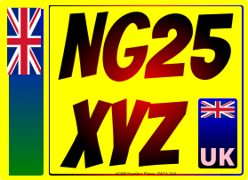

# Example Square Plates

A collection of square plates created with the Plateit number plate generator and the code used to create them.

## Standard Car Square


```javascript
// Document
plate.document.setWidth(279)
plate.document.setHeight(203)

// Background
plate.background.setBackgroundColour('yellow')
plate.background.utilise(true)

// Reg
plate.reg.setText(['NG25', 'XYZ'])
plate.reg.setTextColour('black')
plate.reg.setTextHeight(79)
plate.reg.setTextLineGap(19)
plate.reg.setTextFont('../assets/fonts/CharlesWright-Car.ttf')
plate.reg.utilise(true)

// Bottom Line
plate.bottomLine.setText('ACME Number Plates, SW1A 2AA')
plate.bottomLine.setTextHeight(4)
plate.bottomLine.setTextFont('../assets/fonts/OpenSans-Regular.ttf')
plate.bottomLine.utilise(true)

// Bsau
plate.bsau.setTextFont('../assets/fonts/OpenSans-Regular.ttf')
plate.bsau.setTextHeight(2)
plate.bsau.utilise(true)

// Render
plate.render()
```

## Standard Car Square with Border and Side Badge


> **This will almost always be illegal for road use!** This is because the reg needs to be shrunk to fit a full-height side badge. To adhere to legal specifications on multi-line plates, opt for a [floating side badge](#standard-car-square-with-border-and-floating-side-badge) instead.

```javascript
// Document
plate.document.setWidth(279)
plate.document.setHeight(203)

// Background
plate.background.setBackgroundColour('yellow')
plate.background.utilise(true)

// Reg
plate.reg.setText(['NG25', 'XYZ'])
plate.reg.setTextColour('black')
plate.reg.setTextHeight(79)
plate.reg.setTextLineGap(19)
plate.reg.setTextFont('../assets/fonts/CharlesWright-Car.ttf')
plate.reg.utilise(true)

// Bottom Line
plate.bottomLine.setText('ACME Number Plates, SW1A 2AA')
plate.bottomLine.setTextHeight(4)
plate.bottomLine.setTextFont('../assets/fonts/OpenSans-Regular.ttf')
plate.bottomLine.utilise(true)

// Bsau
plate.bsau.setTextFont('../assets/fonts/OpenSans-Regular.ttf')
plate.bsau.setTextHeight(2)
plate.bsau.utilise(true)

// Border
plate.border.setThickness(2)
plate.border.setColour('black')
plate.border.utilise(true)

// Left Side Badge
plate.sideBadgeLeft.setWidth(44)
plate.sideBadgeLeft.setBackgroundColour('blue')
plate.sideBadgeLeft.setImage('../assets/badges/FlagUnionJack.svg')
plate.sideBadgeLeft.setText(['UNITED', 'KINGDOM'])
plate.sideBadgeLeft.setTextFont('../assets/fonts/OpenSans-ExtraBold.ttf')
plate.sideBadgeLeft.utilise(true)

// Render
plate.render()
```
## Standard Car Square with Border and Floating Side Badge


> Designed for multi-line plates only, a "floating" side badge will always position itself on the shortest line and will be the same height as the registration text.

```javascript
// Document
plate.document.setWidth(279)
plate.document.setHeight(203)

// Background
plate.background.setBackgroundColour('yellow')
plate.background.utilise(true)

// Reg
plate.reg.setText(['NG25', 'XYZ'])
plate.reg.setTextColour('black')
plate.reg.setTextHeight(79)
plate.reg.setTextLineGap(19)
plate.reg.setTextFont('../assets/fonts/CharlesWright-Car.ttf')
plate.reg.utilise(true)

// Bottom Line
plate.bottomLine.setText('ACME Number Plates, SW1A 2AA')
plate.bottomLine.setTextHeight(4)
plate.bottomLine.setTextFont('../assets/fonts/OpenSans-Regular.ttf')
plate.bottomLine.utilise(true)

// Bsau
plate.bsau.setTextFont('../assets/fonts/OpenSans-Regular.ttf')
plate.bsau.setTextHeight(2)
plate.bsau.utilise(true)

// Border
plate.border.setThickness(2)
plate.border.setColour('black')
plate.border.utilise(true)

// Left Side Badge
plate.sideBadgeLeft.setWidth(44)
plate.sideBadgeLeft.setBackgroundColour('blue')
plate.sideBadgeLeft.setImage('../assets/badges/FlagUnionJack.svg')
plate.sideBadgeLeft.setText(['UNITED', 'KINGDOM'])
plate.sideBadgeLeft.setTextFont('../assets/fonts/OpenSans-ExtraBold.ttf')
plate.sideBadgeLeft.setInsideBorder(true)
plate.sideBadgeLeft.setFloating(true)
plate.sideBadgeLeft.utilise(true)

// Render
plate.render()
```
## Standard Motorcycle Square


> Note the different font file and dimensions.

```javascript
// Document
plate.document.setWidth(229)
plate.document.setHeight(178)

// Background
plate.background.setBackgroundColour('yellow')
plate.background.utilise(true)

// Reg
plate.reg.setText(['NG25', 'XYZ'])
plate.reg.setTextColour('black')
plate.reg.setTextHeight(64)
plate.reg.setTextLineGap(19)
plate.reg.setTextFont('../assets/fonts/CharlesWright-Motorcycle.ttf')
plate.reg.utilise(true)

// Bottom Line
plate.bottomLine.setText('ACME Number Plates, SW1A 2AA')
plate.bottomLine.setTextHeight(4)
plate.bottomLine.setTextFont('../assets/fonts/OpenSans-Regular.ttf')
plate.bottomLine.utilise(true)

// Bsau
plate.bsau.setTextFont('../assets/fonts/OpenSans-Regular.ttf')
plate.bsau.setTextHeight(2)
plate.bsau.utilise(true)

// Render
plate.render()
```

## Standard Motorcycle Square With Border and Floating Side Badge


```javascript
// Document
plate.document.setWidth(229)
plate.document.setHeight(178)

// Background
plate.background.setBackgroundColour('yellow')
plate.background.utilise(true)

// Reg
plate.reg.setText(['NG25', 'XYZ'])
plate.reg.setTextColour('black')
plate.reg.setTextHeight(64)
plate.reg.setTextLineGap(19)
plate.reg.setTextFont('../assets/fonts/CharlesWright-Motorcycle.ttf')
plate.reg.utilise(true)

// Bottom Line
plate.bottomLine.setText('ACME Number Plates, SW1A 2AA')
plate.bottomLine.setTextHeight(4)
plate.bottomLine.setTextFont('../assets/fonts/OpenSans-Regular.ttf')
plate.bottomLine.utilise(true)

// Bsau
plate.bsau.setTextFont('../assets/fonts/OpenSans-Regular.ttf')
plate.bsau.setTextHeight(2)
plate.bsau.utilise(true)

// Border
plate.border.setThickness(2)
plate.border.setInnerMargin(3)
plate.border.setColour('black')
plate.border.utilise(true)

// Left Side Badge
plate.sideBadgeLeft.setWidth(30)
plate.sideBadgeLeft.setBackgroundColour('blue')
plate.sideBadgeLeft.setImage('../assets/badges/FlagUnionJack.svg')
plate.sideBadgeLeft.setText(['UNITED', 'KINGDOM'])
plate.sideBadgeLeft.setTextFont('../assets/fonts/OpenSans-ExtraBold.ttf')
plate.sideBadgeLeft.setInsideBorder(true)
plate.sideBadgeLeft.setFloating(true)
plate.sideBadgeLeft.utilise(true)

// Render
plate.render()
```
## Wacky



> A completely illegal, wacky (and tacky) number plate to demonstrate its capabilities.

```javascript
// Document
plate.document.setWidth(279)
plate.document.setHeight(203)

// Background
plate.background.setBackgroundColour('yellow')
plate.background.utilise(true)

// Reg
plate.reg.setText(['NG25', 'XYZ'])
plate.reg.setTextColour(['red', 'black', 'r'])
plate.reg.setTextHeight(79)
plate.reg.setTextLineGap(19)
plate.reg.setTextFont('../assets/fonts/Bangers-Regular.ttf')
plate.reg.utilise(true)

// Bottom Line
plate.bottomLine.setText('ACME Number Plates, SW1A 2AA')
plate.bottomLine.setTextHeight(4)
plate.bottomLine.setTextFont('../assets/fonts/OpenSans-Regular.ttf')
plate.bottomLine.utilise(true)

// Bsau
plate.bsau.setTextFont('../assets/fonts/OpenSans-Regular.ttf')
plate.bsau.setTextHeight(2)
plate.bsau.utilise(true)

// Border
plate.border.setThickness(2)
plate.border.setColour(['black', 'red', 'blue'])
plate.border.utilise(true)

// Left Side Badge
plate.sideBadgeLeft.setWidth(44)
plate.sideBadgeLeft.setBackgroundColour(['blue', 'green', 'y'])
plate.sideBadgeLeft.setImage('../assets/badges/FlagUnionJackPortrait.svg')
plate.sideBadgeLeft.setText(['UNITED', 'KINGDOM'])
plate.sideBadgeLeft.setTextColour('black')
plate.sideBadgeLeft.setTextCutOut(true)
plate.sideBadgeLeft.setTextFont('../assets/fonts/OpenSans-ExtraBold.ttf')
plate.sideBadgeLeft.utilise(true)

// Right Side Badge
plate.sideBadgeRight.setWidth(44)
plate.sideBadgeRight.setBackgroundColour(['blue', 'black', 'y'])
plate.sideBadgeRight.setImage('../assets/badges/FlagUnionJack.svg')
plate.sideBadgeRight.setText('UK')
plate.sideBadgeRight.setTextColour('pink')
plate.sideBadgeRight.setTextFont('../assets/fonts/OpenSans-ExtraBold.ttf')
plate.sideBadgeRight.setInsideBorder(true)
plate.sideBadgeRight.setFloating(true)
plate.sideBadgeRight.utilise(true)

// Render
plate.render()
```
[Example Oblong Plates](examples/oblongs.md)