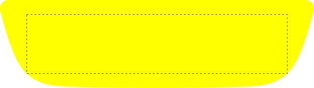

# Shaped Plates

To create a shaped number plate you will first need a shaped plate template file that adheres to some simple rules. Once a template file exists, it can be referenced in the [Background](/components/background.md) component.

## Template Rules

* **File Format:** The template must be an SVG file.
* **Dimensions:** The `viewBox` attribute should accurately reflect the width and height of the plate in mm.
* **Plate Shape Path:** Include a `<path>` element that extends to all four edges, identified by the ID `plate`.
* **Boundary Rectangle:** Include a `<rect>` element with the ID `boundary`. This will serve as the maximum area for the registration.
  * **Centring:** The boundary should be centred both vertically and horizontally, fitting within the `<path>` without any overlap.
  * **Height:** The boundary height must exceed the intended registration height, 95mm works well for most shaped car plates.
* **Border Path:** Include a `<path>` element that sits within the outer plate shape path, inset by 5mm identified by the ID `border`.
  * **Polyline:** The border path needs to be *polyline-only*. It should contain no curves and use only `M`, `L`, and `Z` commands. This allows the renderer to slice and manipulate path segments directly, without additional processing or external dependencies.

> The border path element is optional, but if it's missing from the template file, a border will not render if instructed to do so.

## Example Template File

Below is an example template file for a Jaguar X-Type Saloon plate. The registration boundary (the section with the dotted outline) is 95mm tall, centred on both axes, and its width maximizes the available space without overlapping the outer shape.

There is also a polyline border path.



!> The boundary will shrink inwards in accordance with margins and borders which is why its height should be taller than the intended registration height which is typically 79mm. This is also why the boundary should extend width-ways as far as it can go before overlapping with the outer path.

## Example Template Code

For the full code, inspect the SVG source of the image above. For a more simplistic overview, see the pseudo code below:

```xml
<svg xmlns="http://www.w3.org/2000/svg" viewBox="0 0 639 179">
  <path id="plate" fill="#ff0" d="path data goes here"/>
  <path id="border" fill="none" stroke="black" stroke-width="2" d="path data goes here"/>
  <rect id="boundary" x="44" y="42" width="552" height="95"/>
</svg>
```